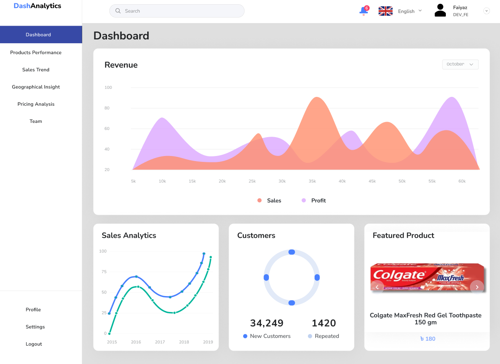

# Dash Analytics: Consumer Data Analysis And Visualization Project

This project focuses on analyzing and visualizing consumer data to derive actionable insights for businesses. By leveraging data science techniques, we aim to enhance customer relationships, optimize marketing strategies, and improve overall decision-making processes. We are using various data science tools and libraries in Python, including Pandas, NumPy, Matplotlib, Seaborn, and Plotly. The project also emphasizes the importance of data visualization in understanding complex patterns and trends in consumer behavior. We will be using machine learning algorithms for predictive analysis and customer segmentation. The final deliverable will include a comprehensive report and interactive dashboards to present the findings effectively.

## Team members

* Nusrat Jahan Sumaiya-22234103100
* Sadikul Amin Sadman-22234103128
* Md. Faiyazur Rahman-22234103093
* Md. Khairul Bashar Hasib-22234103102
* Rakibul Hasan Rakib-22234103096

## 1.1 Introduction

Organizations need a comprehensive understanding of consumer behavior in today's competitive market to optimize their strategies and improve decision-making. This project leverages data science techniques and visualization tools to transform consumer data into actionable insights, enabling businesses to enhance customer relationships, personalize marketing efforts, and optimize operations.

## 1.2 Problem Statement

Despite the availability of vast amounts of consumer data, businesses face challenges in:
Extracting actionable insights from unstructured data.
Visualizing complex patterns and trends in customer behavior.
Integrating data across multiple channels for a unified view.
Personalizing customer interactions and optimizing campaigns.

## 1.3 Motivation

This project is motivated by the growing importance of data-driven decision-making and the limitations of manual systems. By addressing these challenges, businesses can unlock the potential of their data, improve operational efficiency, and enhance customer satisfaction.

## 1.4 Objective of the Project

The primary objectives include:
Aggregating data from multiple sources.
Conducting customer segmentation and profiling.
Performing predictive analysis for decision-making.
Visualizing insights through interactive dashboards.
