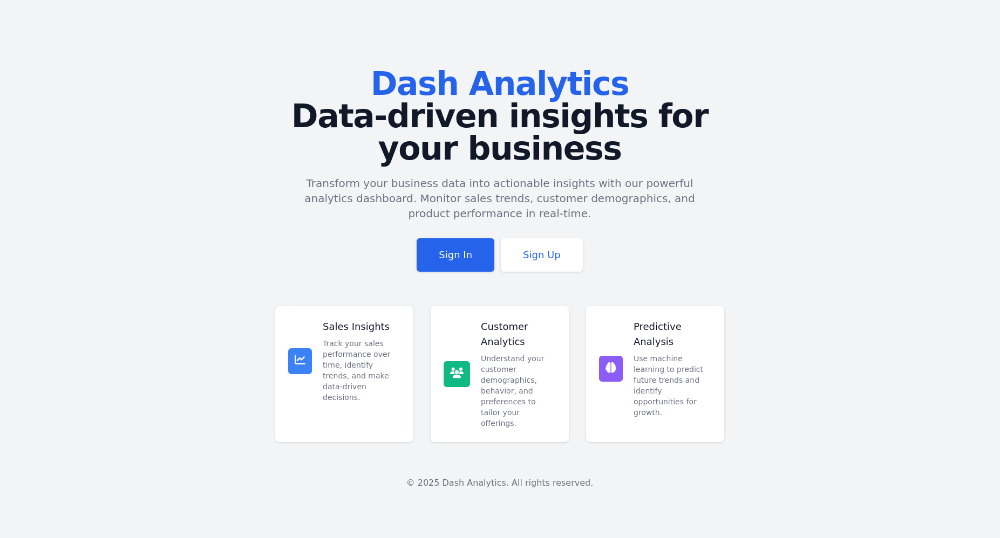

# Dash Analytics: Consumer Data Analysis And Visualization Project

A comprehensive data analytics and visualization platform built with Django and MongoDB, featuring real-time dashboards, predictive analytics, and customer behavior insights.



## Features

- 📊 Interactive Dashboards
- 📈 Sales Trend Analysis
- 👥 Customer Behavior Analytics
- 🌍 Geographical Insights
- 📱 Responsive Design
- 🌓 Dark/Light Theme
- 📊 Data Upload & Management
- 🤖 ML-Powered Predictions

## Tech Stack

- **Backend**: Django 4.2, Django REST Framework
- **Database**: MongoDB 8.0+ with MongoEngine
- **Frontend**: TailwindCSS 3.6+, Chart.js
- **Data Analysis**: Pandas 2.0+, NumPy 1.24+, Scikit-learn 1.3+
- **ML Models**: Prophet 1.1+

## Prerequisites

- Python 3.12+
- MongoDB 8.0+
- Node.js 18+ (for TailwindCSS)
- Git

## Installation

1. Clone the repository:

```bash
git clone <repository-url>
cd DashAnalytics
```

2. Create a virtual environment:

```bash
python -m venv venv
source venv/bin/activate  # On Windows: venv\Scripts\activate
```

3. Install dependencies:

```bash
pip install -r dash_analytics/requirements.txt
```

4. Setup MongoDB:

   a. **MongoDB Atlas** (Cloud):
   - Create a free MongoDB Atlas account at <https://www.mongodb.com/cloud/atlas>
   - Create a new cluster
   - In the "Network Access" tab, add your IP address
   - In the "Database Access" tab, create a new database user
   - Click "Connect" on your cluster, then "Connect your application"
   - Copy the connection string and update it in `dash_analytics/dash_analytics/settings.py`:

   ```python
   MONGODB_ATLAS_URI = 'mongodb+srv://<username>:<password>@<cluster>.mongodb.net/<dbname>'
   ```

   b. **MongoDB Compass** (Local):
   - Install MongoDB locally from <https://www.mongodb.com/try/download/community>
   - Install MongoDB Compass from <https://www.mongodb.com/try/download/compass>
   - Open MongoDB Compass and connect to your local MongoDB instance
   - Add the connection string in URI in new connection

5. Run migrations:

```bash
cd dash_analytics
python manage.py makemigrations
python manage.py migrate
```

6. Create a superuser (admin):

```bash
python manage.py createsuperuser
```

7. Start the development server:

```bash
python manage.py runserver
```

The application will be available at:

- Main application: <http://localhost:8000>
- Admin interface: <http://localhost:8000/admin>
- API endpoints: <http://localhost:8000/api/>

## Project Structure

- `analytics/` - Data analysis and ML model endpoints
- `api/` - REST API implementation
- `core/` - Main application logic
- `dataset/` - Sample data and datasets
- `data_analysis_ml_code/` - Jupyter notebooks and ML scripts
- `templates/` - Frontend templates
- `static/` - Static assets

## Team Members

- Nusrat Jahan Sumaiya - 22234103100
- Sadikul Amin Sadman - 22234103128
- Md. Faiyazur Rahman - 22234103093
- Md. Khairul Bashar Hasib - 22234103102
- Rakibul Hasan Rakib - 22234103096

## Features in Detail

### Data Analytics

- Sales performance tracking
- Customer segmentation
- Product performance analysis
- Geographical distribution analysis

### Predictive Analytics

- Sales forecasting
- Customer churn prediction
- Product demand prediction
- Trend analysis

### Visualization

- Interactive charts and graphs
- Real-time data updates
- Custom date range filters
- Export capabilities

### Data Management

- CSV data import through web interface
- Automatic data validation and cleaning
- Historical data tracking with MongoDB
- Automated backup and restore features
- Sample dataset included in /dataset directory

## API Documentation

The REST API is available at `/api/` with the following endpoints:

- `/api/customers/` - Customer data management
- `/api/products/` - Product information
- `/api/orders/` - Order processing and history
- `/api/analysis/` - Analytics results
- `/api/predictions/` - ML model predictions

## Contributing

1. Fork the repository
2. Create your feature branch
3. Commit your changes
4. Push to the branch
5. Create a new Pull Request

## License

This project is licensed under the MIT License.
